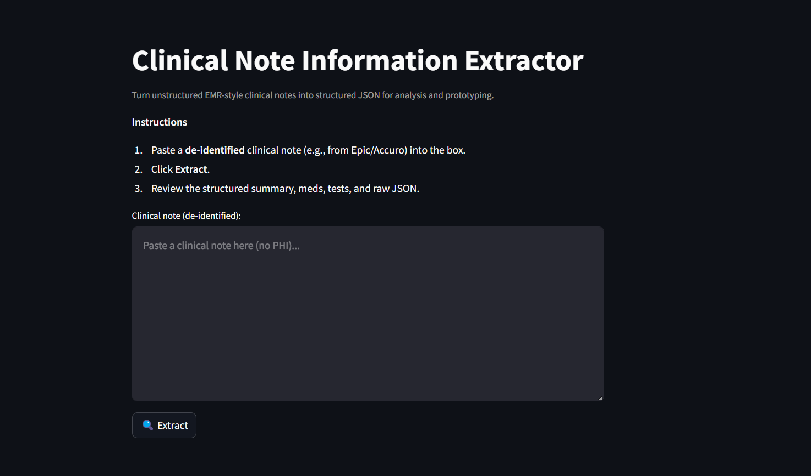
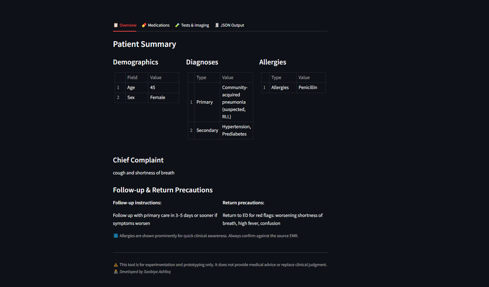
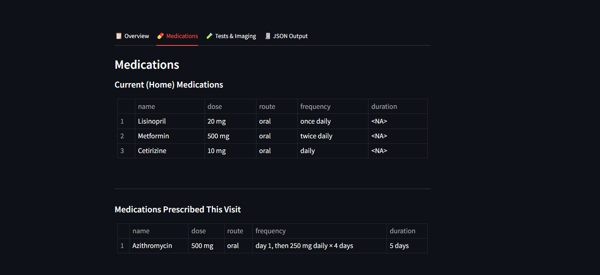
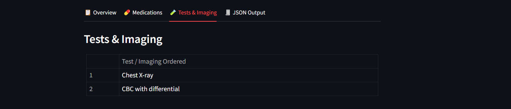
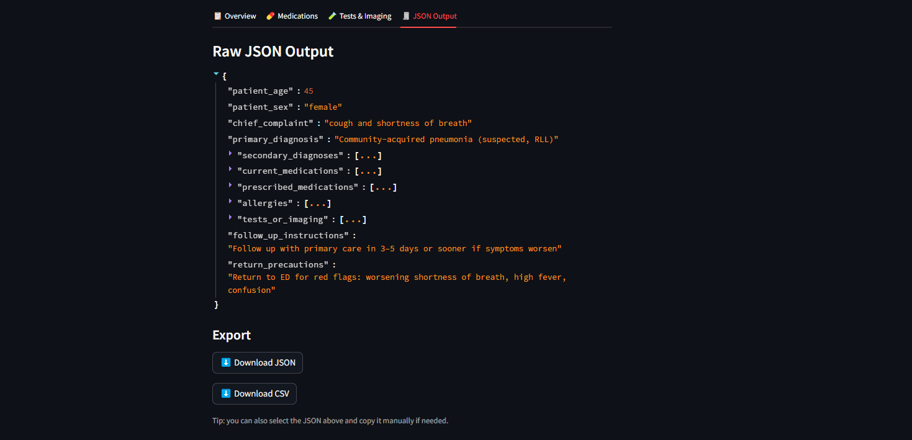

<div align="center">



<h1 align="center"> Clinical Note Information Extractor 🔎</h1>


[](https://clinical-note-extractor.streamlit.app/)


</div>


<p align="center">
  <a href="#overview">Overview</a> •
  <a href="#features">Features</a> •
  <a href="#live-demo">Live Demo</a> •
  <a href="#app-usage">App Usage</a> •
  <a href="#tech-stack">Tech Stack</a> •
  <a href="#installation">Installation</a> •
  <a href="#acknowledgements">Acknowledgements</a> •
  <a href="#license">License</a>
</p>

<div align="center">
Convert unstructured EHR-style clinical notes (Epic, Accuro, Cerner, Allscripts, OSCAR, MedAccess) into structured JSON using LLMs.

</div>

---

## 🧠 Overivew <a name="overview"></a>

Modern healthcare teams deal with long, inconsistent, and unstructured clinical notes.  
This tool converts **free-text** EHR-style documentation into **structured, analysis-ready JSON** using an optimized LLM pipeline.

The extracted structured data includes: 
- Patient demographics 
- Chief complaint 
- Primary & secondary diagnoses 
- Allergies (priority extracted)
- Current (home) medications 
- Medications prescribed during the visit 
- Tests & imaging orders 
- Follow-up instructions 
- Return precautions

The app supports notes exported from common EMR/EHRs:
> Epic, Accuro, Cerner, Allscripts, OSCAR, MedAccess

The goal is to help health informatics teams, clinicians, researchers, and developers transform chart notes into structured analytics-ready data.

⚠️ *For **de-identified** text only. Not for use with PHI.*

## ✨ Features <a name="features"></a>

#### 🔍 LLM-Powered Clinical NLP Extraction
Uses **Llama-3.3-70B** via Groq for fast, deterministic extraction using LangChain.

#### 📋 Beautiful Streamlit UI
Organized tabs:

- Overview
- Medications (Separated: Home vs Prescribed)
- Tests & Imaging
- JSON Output

#### 💊 Medication Parsing w/ Complex Regimens
Accurately parses complex regimens like:
> *“Start Azithromycin 500 mg PO day 1, then 250 mg daily × 4 days”*

#### ⚠️ Allergies Displayed Prominently
Displayed in the Overview tab for quick clinician safety checks.

#### 📑 Exports
- Download JSON
- Download CSV
- Copy JSON from UI

#### 🏥 EHR-Aware Instructions
Prompt is optimized for SOAP notes and common EHR section headers.

## 🌐 Live Demo <a name="live-demo"></a>

The app is deployed on **Streamlit Cloud** and accessible here:  
👉 **[Clinical Note Extractor](https://clinical-note-extractor.streamlit.app/)**


## 📋 App Usage <a name="app-usage"></a>

1. Launch the Streamlit application using the **Live Demo** link or by running it locally.  
2. Paste a **de-identified** clinical note into the text area.  
3. Click **Extract** to generate structured output.  
4. Navigate through the tabs to review:
   - **Overview** (demographics, diagnoses, allergies)
   - **Medications** (separated into *current/home* and *prescribed during visit*)
   - **Tests & Imaging**
   - **JSON Output** (with download options)
5. Export your data:
   - **Download JSON**
   - **Download CSV**
   - Or copy the JSON directly from the UI

### 📸 Screenshots
Here are a few screenshots of what the app looks like after the Extract button has been cliked.

#### Overview Tab


#### Medications Tab


#### Tests & Imaging Tab


#### JSON Output Tab



#### Example input note you can test with:
```sql
45-year-old female presenting with cough, fever, and SOB...
Start Azithromycin 500 mg PO day 1, then 250 mg daily × 4 days...
CBC and Chest X-ray ordered...

```

#### 📦 Example JSON Output

```json
{
  "patient_age": 45,
  "patient_sex": "female",
  "chief_complaint": "cough, fever, and SOB",
  "primary_diagnosis": null,
  "secondary_diagnoses": [],
  "current_medications": [],
  "prescribed_medications": [
    {
      "name": "Azithromycin",
      "dose": "500 mg",
      "route": "oral",
      "frequency": "day 1, then 250 mg daily × 4 days",
      "duration": "5 days"
    }
  ],
  "allergies": [],
  "tests_or_imaging": [
    "CBC",
    "Chest X-ray"
  ],
  "follow_up_instructions": null,
  "return_precautions": null
}
```

## 🧰 Architecture Diagram

                    ┌─────────────────────────┐
                    │      Streamlit UI       │
                    │         (app)           │
                    └─────────────┬───────────┘
                                  │
                                  ▼
                    ┌─────────────────────────┐
                    │  clinical_extractor.py  │
                    │  (LLM prompt + parser)  │
                    └─────────────┬───────────┘
                                  │ JSON
                                  ▼
                    ┌─────────────────────────┐
                    │        Groq API         │
                    │    Llama-3.3-70B model  │
                    └─────────────┬───────────┘
                                  │
                                  ▼
                    ┌─────────────────────────┐
                    │  Extracted Structured   │
                    │  Clinical Information   │
                    └─────────────────────────┘


## 🛠️ Tech Stack <a name="tech-stack"></a>
This project demonstrates practical across **AI engineering**, **healthcare NLP**, and **full-stack data application development**.

**Core Technologies**
- **Python 3.10+**
- **Streamlit** — Interactive UI for clinicians, analysts, and recruiters  
- **LangChain** — Orchestrates LLM prompts, parsing, validation
- **Groq API** — Ultra-fast inference for Llama-3.3-70B
- **Llama-3.3-70B** — Clinical-grade reasoning for structured extraction
- **Pandas** — JSON flattening + CSV export
- **dotenv** — Secure environment variable management

**Demonstrated Skills**
- LLM prompt engineering  
- Healthcare-specific information extraction  
- Full-stack AI app architecture  
- JSON schema design  
- Complex medication regimen parsing  
- EMR-aware NLP (Epic, Cerner, Accuro, etc.)  
- Clean UI/UX for clinical workflows  
- Production-ready modular code structure  


## 📁 Project Structure

```bash
clinical-note-extractor/
│
├── .env                          # Environment variable API key
├── app.py                        # Streamlit UI
├── clinical_extractor.py         # LLM extraction logic
├── requirements.txt              # Python dependencies
├── screenshots/                  # Folder containing app visuals
│   ├── home.png
│   ├── overview.png
│   ├── meds.png
│   ├── tests.png
│   └── json.png
└── README.md                     # Project documentation
```

## 🔧 Installation <a name="installation"></a>

#### Prerequisites:  
- Python 3.10+

1. **Clone the repo**:
    ```bash
    git clone https://github.com/sashfaq911/Clinical_Note_Extractor.git
    cd Clinical_Note_Extractor
    ```
2. **Create & activate virtual environment**:
    ```bash
    python3 -m venv venv
    source venv/bin/activate   # Mac/Linux
    venv\Scripts\activate      # Windows
    ```
3. **Install dependencies** 
    ```bash
    pip install -r requirements.txt
    ```

4. **Add your environment variables**
    ```ini
    GROQ_API_KEY=your_key_here
    ```

5. **Run the app**
    ```bash
    streamlit run app.py
    ```

## 🙏 Acknowledgements <a name="acknowledgements"></a>
This project was inspired by Codebasics "Financial Data Extractor" as part of the [CodeBasics Gen AI & Data Science BootCamp](https://codebasics.io/bootcamps/dashboard/ai-data-science-bootcamp-with-virtual-internship). 
After learning how to build the financial data extractor app, I decided to get my own hands dirty with a use case relevant to the healthcare industry. 

A special thanks to [Dhaval Patel](https://www.linkedin.com/in/dhavalsays/) and [Hemanand Vadivel](https://www.linkedin.com/in/hemvad/) for their guidance throughout the bootcamp.This project has been an incredible 
learning experience and a key milestone in my ability to building LLM apps. 


## 📄 License <a name="license"></a>

This project is licensed under the **MIT License**. See the [LICENSE](./LICENSE) file for details.


## ❤️  Support

🤝 Contributions welcome ! 
Please open an issue or submit a pull request.

Give a ⭐️ if you like this project!
